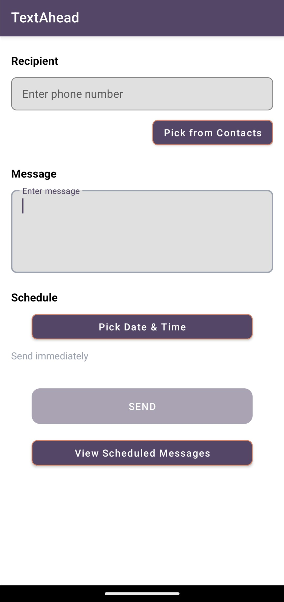
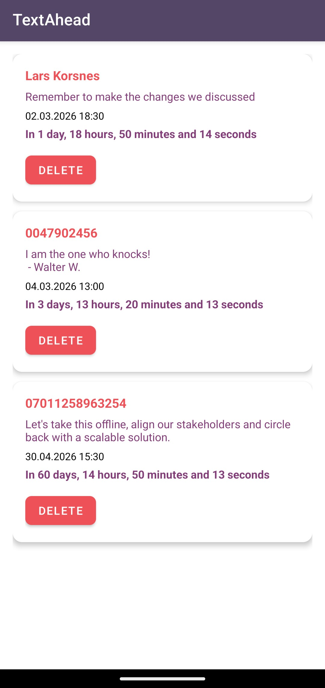

# TextAhead

**Schedule SMS messages for later delivery.**

TextAhead is a free and open-source Android app that allows users to write SMS messages and schedule them for future delivery. The app is designed with privacy in mind: no servers, no data collection, and no tracking. All messages are stored locally on your device.

---

## **Why TextAhead?**
TextAhead addresses two key limitations in existing open-source messaging solutions:

1. **Reliability**:
   Some open-source general-purpose messaging apps claim to support scheduled SMS, but their implementations suffer from critical bugs—such as crashes when deleting pending messages. TextAhead is designed to handle these operations **stably and predictably**, ensuring a seamless user experience.

2. **Dedicated Scheduling**:
   Unlike general-purpose messaging apps, TextAhead is built **exclusively for scheduling SMS**. This focus allows users to **centralize and manage all scheduled messages in one place**, without cluttering their primary messaging app. Once a message is delivered, TextAhead hands it off to the system’s default messaging app and **forgets it**, ensuring no residual data or unnecessary storage.

---

## **Features**
- Write and schedule SMS messages for future delivery.
- View pending messages with a real-time countdown (e.g., "In 2 days, 44 minutes, and 37 seconds").
- Option to delete scheduled messages before they are sent.
- No internet connection required.
- No data collection or tracking.
- Messages are sent automatically when the device is powered on and has an active connection to the mobile network and the scheduled time is passed.

---

## **Screenshots**
| Main Screen | Scheduled Messages List |
|-------------|-------------------------|
|  |  |

---

## **Installation**
### **From F-Droid**
TextAhead is available on [F-Droid](https://f-droid.org). Search for "TextAhead" and install it directly.

### **From Source**
1. **Clone the repository**:
   ```bash
   git clone https://github.com/yourusername/TextAhead.git
   ```
2. **Open the project in Android Studio**:
   - Launch Android Studio.
   - Select **File > Open** and navigate to the cloned `TextAhead` directory.
   - Wait for Android Studio to sync the project.

3. **Build and run the app**:
   - Connect an Android device or use an emulator.
   - Click the **Run** button (green triangle) in Android Studio to build and install the app.

---

## **Requirements**
- Android 7.0 (API 24) or higher.
- **Permissions**: SMS (to send messages) and Contacts (to read contacts).

---

## **Privacy Policy**
TextAhead does **not** collect, store, or share any user data. All messages and schedules are stored locally on your device.

---

## **License**
TextAhead is free software: you can redistribute it and/or modify it under the terms of the [GNU General Public License v3.0](LICENSE).

---

## **Contributing**
Contributions are welcome! Here’s how you can help:
1. Fork this repository.
2. Create a new branch for your feature or bug fix.
3. Commit your changes and push the branch.
4. Submit a pull request with a clear description of your changes.

For major changes, please open an issue first to discuss the proposed changes.

---

## **Contact**
For questions or feedback, contact [Lars Korsnes](mailto:dev.lars@proton.me).
